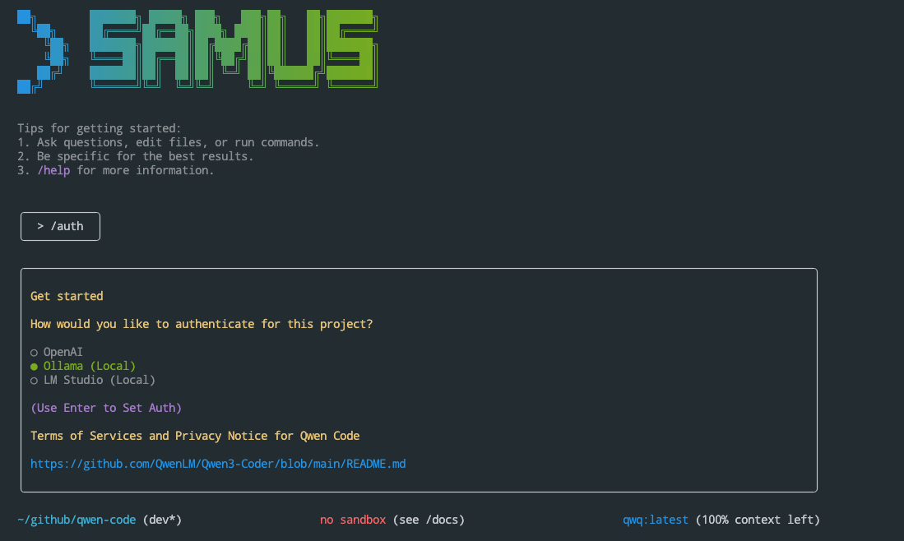

# Samus Code



Samus Code is a command-line AI workflow tool adapted from [**Qwen Code**](https://github.com/QwenLM/qwen-code) (Please refer to [this document](./README.gemini.md) for more details), optimized for working with local LLM models with enhanced parser support & tool support.

## Key Features

- **Code Understanding & Editing** - Query and edit large codebases beyond traditional context window limits
- **Workflow Automation** - Automate operational tasks like handling pull requests and complex rebases
- **Enhanced Parser** - Adapted parser specifically optimized for Samus-Coder models

## Quick Start

### Prerequisites

Ensure you have [Node.js version 20](https://nodejs.org/en/download) or higher installed.

```bash
curl -qL https://www.npmjs.com/install.sh | sh
```

### Installation

#### Option 1: Install from npm (Recommended)
```bash
npm install -g samus-code
```

#### Option 2: Build from source
```bash
git clone https://github.com/ochsec/samus-code.git
cd samus-code
npm install
npm run build
npm install -g ./packages/cli
```

Then run from anywhere:

```bash
samus
```

### API Configuration

The tool supports multiple authentication methods and local LLM servers. Below are the configurations for each:

#### **1. Local LLM Servers (Ollama / LM Studio)**
Both servers provide OpenAI-compatible APIs and require no API key. Configure them via environment variables or code.

---

#### **Ollama**
- **Base URL**: Default is `http://localhost:11434`.  
- **Model**: Default is `llama3`.  
- **Environment Variables**:
  ```bash
  export OLLAMA_BASE_URL="http://localhost:11434"
  
  # For model switching feature (weak/strong models)
  export OLLAMA_MODEL_WEAK="llama3.2"
  export OLLAMA_MODEL_STRONG="llama3.1:70b"
  ```
- **Prerequisites**:
  - Run the Ollama server: `ollama serve`.
  - Verify server health: The code checks `/<baseUrl>/api/tags`.

---

#### **LM Studio**
- **Base URL**: Default is `http://localhost:1234`.  
- **Model**: Default is `local-model`.  
- **Environment Variables**:
  ```bash
  export LM_STUDIO_BASE_URL="http://localhost:1234"
  
  # For model switching feature (weak/strong models)
  export LM_STUDIO_MODEL_WEAK="phi-3-mini"
  export LM_STUDIO_MODEL_STRONG="mixtral-8x7b"
  ```
- **Prerequisites**:
  - Ensure the LM Studio server is running.
  - Verify server health: The code checks `/<baseUrl>/v1/models`.

---

#### **Key Notes**
- **No API Key Required**: Both servers use `apiKey: 'not-required'` in the config.
- **OpenAI Compatibility**: The base URL is adjusted to point to the server's OpenAI-compatible endpoint.
- **Model Listing**: Use `listModels()` to fetch available models from the local server.

#### **OPENAI-Compatible APIs**
Currently, the application supports OpenAI-compatible APIs using the following environment variables:

```bash
# OpenAI API Configuration
export OPENAI_API_KEY="your_openai_api_key"
export OPENAI_BASE_URL="https://api.openai.com/v1"

# For model switching feature (weak/strong models)
export OPENAI_MODEL_WEAK="claude-3-5-haiku-20241022"
export OPENAI_MODEL_STRONG="claude-3-5-sonnet-20241022"
```

**Notes**:
- Replace `your_openai_api_key` with your actual OpenAI API key.
- `OPENAI_BASE_URL` points to the OpenAI API endpoint.
- For OpenRouter, set `OPENAI_BASE_URL` to `https://openrouter.ai/api/v1` and use your OpenRouter API key for `OPENAI_API_KEY`.
- Ensure you have the necessary permissions and billing setup with OpenAI/OpenRouter.
- Support for other OpenAI-compatible APIs is limited to those that can be configured with these standard OpenAI environment variables.

### Model Switching Feature

Samus Code supports automatic model switching based on task type:
- **Strong models** are used for repository exploration, planning, troubleshooting, and code review
- **Weak models** are used for implementation and documentation tasks

#### CLI Commands
```bash
# Switch to specific model
> /model llama3.2

# Switch to weak model variant
> /model weak

# Switch to strong model variant  
> /model strong

# Enable/disable automatic switching
> /auto-switch on
> /auto-switch off
```

**Note**: The weak/strong model feature requires setting the `_WEAK` and `_STRONG` environment variables for your provider as shown in the configuration sections above.

## Usage Examples

### Explore Codebases

```sh
cd your-project/
samus
> Describe the main pieces of this system's architecture
```

### Code Development

```sh
> Refactor this function to improve readability and performance
```

### Automate Workflows

```sh
> Analyze git commits from the last 7 days, grouped by feature and team member
```

```sh
> Convert all images in this directory to PNG format
```

## Popular Tasks

### Understand New Codebases

```text
> What are the core business logic components?
> What security mechanisms are in place?
> How does the data flow work?
```

### Code Refactoring & Optimization

```text
> What parts of this module can be optimized?
> Help me refactor this class to follow better design patterns
> Add proper error handling and logging
```

### Documentation & Testing

```text
> Generate comprehensive JSDoc comments for this function
> Write unit tests for this component
> Create API documentation
```

## Benchmark Results

### Terminal-Bench

| Agent     | Model              | Accuracy |
| --------- | ------------------ | -------- |
| Samus Code | Samus3-Coder-480A35 | 37.5     |

## Project Structure

```
samus-code/
├── packages/           # Core packages
├── docs/              # Documentation
├── examples/          # Example code
└── tests/            # Test files
```

## Development & Contributing

See [CONTRIBUTING.md](./CONTRIBUTING.md) to learn how to contribute to the project.

## Troubleshooting

If you encounter issues, check the [troubleshooting guide](docs/troubleshooting.md).

## Acknowledgments

This project is based on [Google Gemini CLI](https://github.com/google-gemini/gemini-cli). We acknowledge and appreciate the excellent work of the Gemini CLI team. Our main contribution focuses on parser-level adaptations to better support Samus-Coder models.

## License

[LICENSE](./LICENSE)
